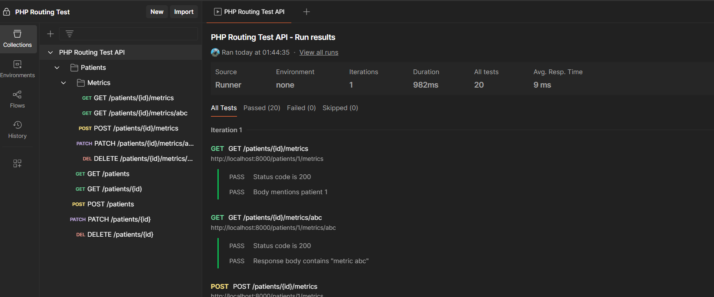

# php-routing-test

Using modern PHP (think PHP7, composer, autoloading, PSR-4, and best practices) please create a "Routing Class" as defined below.

A routing class is designed to take a url segment and automatically invoke a controller class. It does this by breaking up the url segments that come
in a predictable pattern and invoking the correct class and method and inserting parameters into the method invoked. We will be following
a REST-ful convention and be using common http methods. Your Routing class will be aware of the http method and the actual url segment.

Here is the complete requirement. These tables represents all possible routing logic.

## Unnested routes

| Method | Segment      | Controller class name | Controller method name | Parameters                                                      |
| ------ | ------------ | --------------------- | ---------------------- | --------------------------------------------------------------- |
| GET    | /patients    | PatientsController    | index                  | none                                                            |
| GET    | /patients/2  | PatientsController    | get                    | this should invoke `get($patientId)` where $patientId = 2       |
| POST   | /patients    | PatientsController    | create                 | none (extra credit for handling the request body)               |
| PATCH  | /patients/2  | PatientsController    | update                 | `update($patientId)`                                            |       
| DELETE | /patients/2  | PatientsController    | delete                 | `delete($patientId)`                                            |


## Nested routes

| Method | Segment                    | Controller class name         | Controller method name | Parameters                                  |
|------- | -------------------------- | ----------------------------- | ---------------------- | ------------------------------------------- |
| GET    | /patients/2/metrics        | PatientsMetricsController     | index                  | `index($patientId)`                         |
| GET    | /patients/2/metrics/abc    | PatientsMetricsController     | get                    | `get($patientId, $metricId)`                |
| POST   | /patients/2/metrics        | PatientsMetricsController     | create                 | `create($patientId)`                        |
| PATCH  | /patients/2/metrics/abc    | PatientsMetricsController     | update                 | `update($patientId, $metricId)`             |       
| DELETE | /patients/2/metrics/abc    | PatientsMetricsController     | delete                 | `delete($patientId, $metricId)`             |


To invoke the Routing class we'll be calling it statically. For example we'll be defining a `routes.php` that looks like this


```
Route::resource('patients');
Route::resource('patients.metrics');
```

# Architecture Solution

## Directory Structure

```
project-root/
├── src/
│   ├── Controller/
│   │   ├── PatientsController.php
│   │   └── PatientsMetricsController.php
│   ├── Exception/
│   │   └── RouteNotFoundException.php
│   ├── Route.php
│   public/
│   ├── index.php
│   postman/
│   └── collection.postman_collection.json
├── routes.php
└── composer.json
```

## PHP Version

- PHP 8.0 or higher

## Postman Collection
- A Postman collection is provided to test the API endpoints.
- The collection includes requests for all the defined routes.
- You can import the collection into Postman to test the API.
- The collection is located in the `postman` directory.




## How to Run
1. Clone the repository.
2. Navigate to the project directory.
3. Install dependencies using Composer:
   ```bash
   composer install
   ```
4. Start the built-in PHP server:
   ```bash
    php -S localhost:8000 -t public
    ```
5. Open your browser and navigate to `http://localhost:8000` to access the API.

## Test
To run the tests, use the following command:
```bash
vendor/bin/phpunit
```